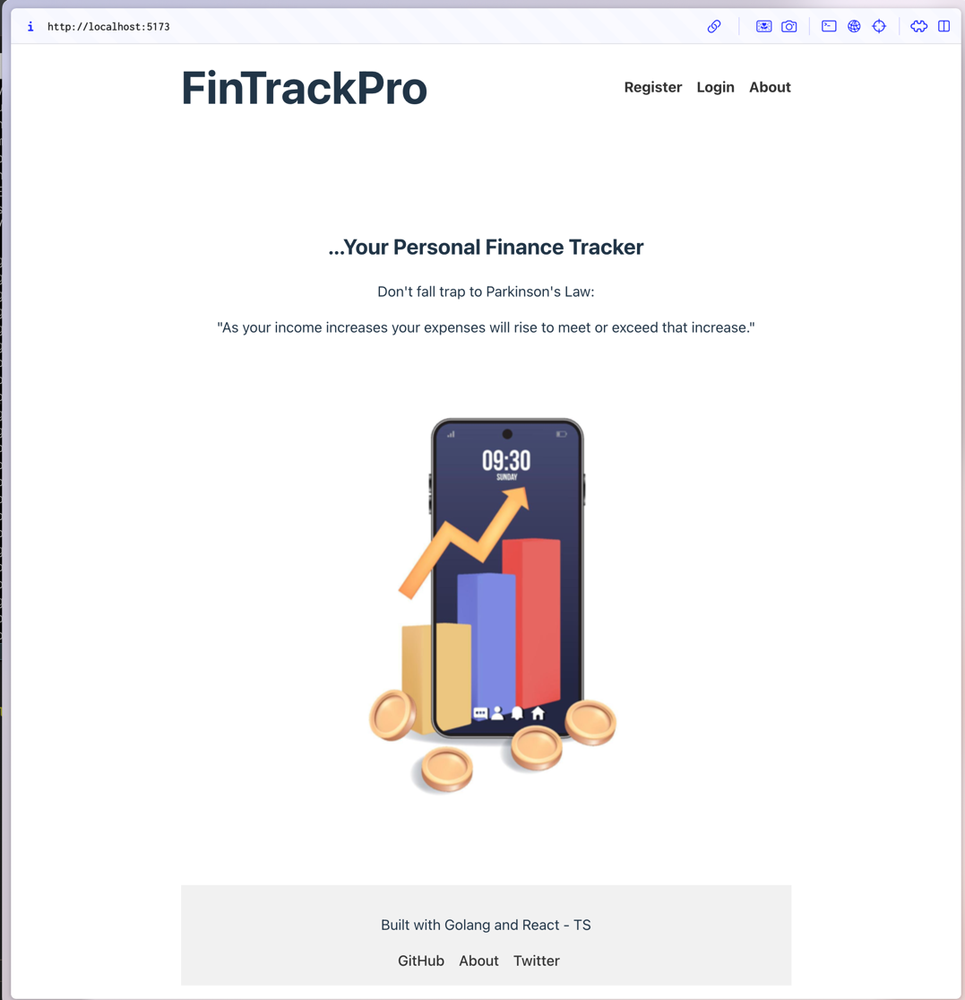

# Personal Finance Tracker

React-Typescript with Golang for a financial application.



Want a Demo?

## Run the App
Backend (port 9020)
```shell
docker-compose up -d
go run main.go
```

Frontend (port 5173)
```shell
npm install
npm run dev
```

## TODO
- [ ] Add a CreateTxn.tsx route that consumes the /transaction endpoint from backend.
- [ ] Add a CreateBudget route that consumes the /budget endpoint from backend.
- [ ] Add a GET request for /transaction and /budget.
- [ ] Consume the GET /transaction and /budget endpoints in the relevant frontend pages.
- [ ] Move to stage 2: supporting investment tracker and providing net worth analytics features.